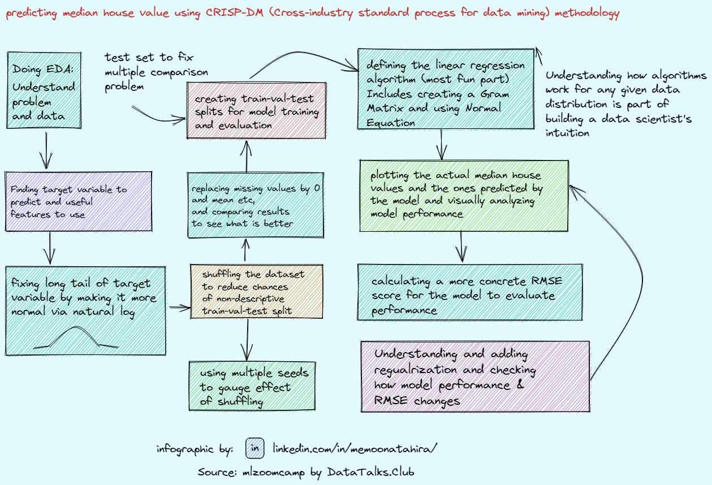

# Week 2: Structuring a Machine Learning Project 

Here I use a logistic regression classification model as an exmaple. 

<!---->

[Click here for a high resolution image](MLZoomcamp_crisp-dm_x2.png)