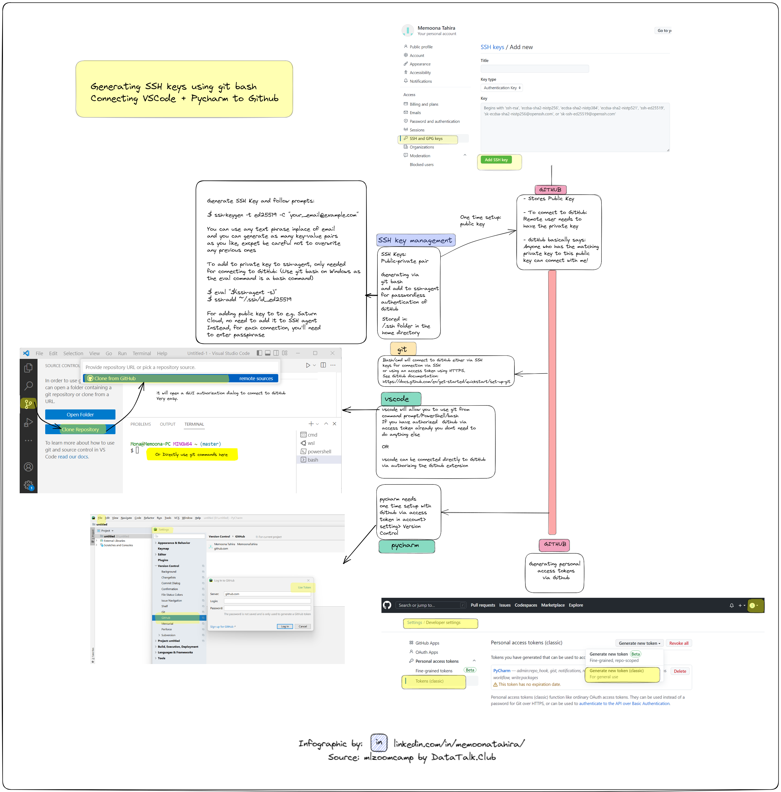
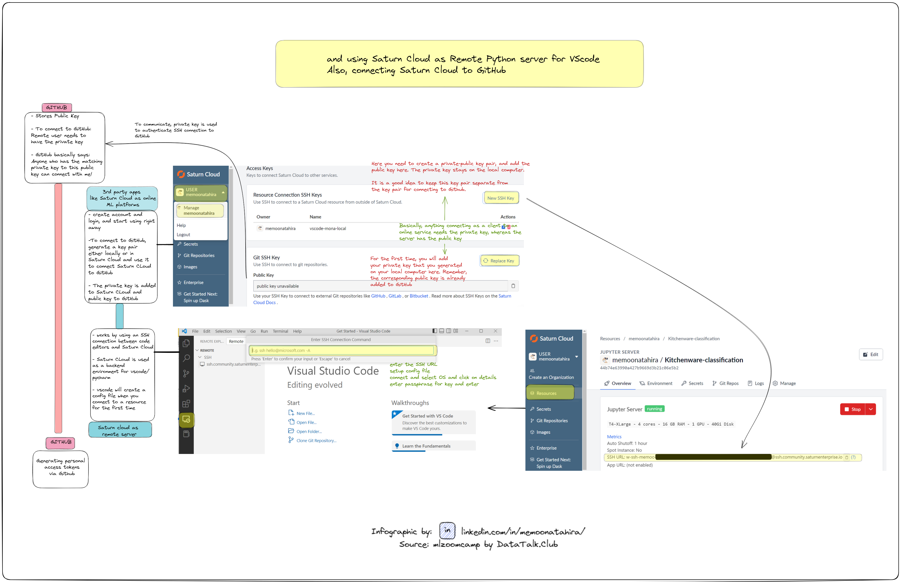
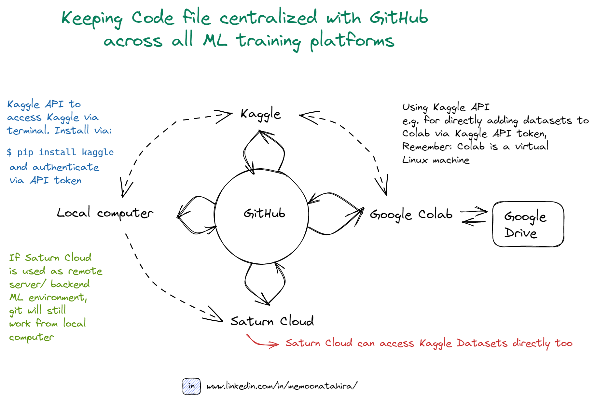

#  Connecting GitHub to Code editors like VSCode and Pycharm:

Often when we work on our local code editors, we want to push our code to GitHub to use it as a central place for storing our code. This way, if we switch computers, or start using a new cloud platform, we can easily get code and data from Github and store any changes back to GitHub. Next time, when we work on our local computers again, all we need to do is sync our GitHub data with the local computer. 

To connect GitHub to code editors on our local computer, you can either use an access token or SSH key. Please see infographic below on how to get the access token or generate an SSH key and use them to connect local code editors to GitHub. 

# Connecting GitHub to online ML Platforms like Saturn Cloud

* We use our locally generated SSH keys to authenticate Saturn Cloud to access our GitHub account to get data, and more importantly, to be able to write back any data that we changes while working on Saturn Cloud. Remember, Saturn cloud deletes data after 8 days of inactivity or after 30 days. Therefore, it is important to store any code changes we do on this platform, ideally via GitHub. 

* We can also use Saturn Cloud as a backend ML environment instead of an online platform by connecting it to our local code editors via an SSH connection. This way, we can keep editing on our local code editors and store data locally but use Saturn Cloud as a remote server and use all its GPU and RAM power! Win win situation.

Please see infrographic below to see how it comes together.

# Connecting GitHub to Kaggle or Google Colab:

* These platforms have a very easy GUI based authentication to connect to Guthub to fetch and save data. However, neither of these online ML platforms can be used as a ML backend environment (or more specifically, as a remote server).

* However, our local computers can still connect to Kaggle via the Kaggle API to fetch competition data, or upload notebooks to Kaggle directly from the local computer. The Kaggle API can be accessed via any command line, for example bash or cmd promt.

 * Similarly, Colab provides an upload function to upload data or notebooks from local computer, but it can only be done from inside a Colab notebook. Colab itself can connect to Kaggle directly too. (Colab is just an online Linux Virtual Machine than can work pretty much like a normal Linux computer.) 

 Have a look at the infograhpic below to see options to connect GitHub to ML platforms, and how they can interact with each other:
 

